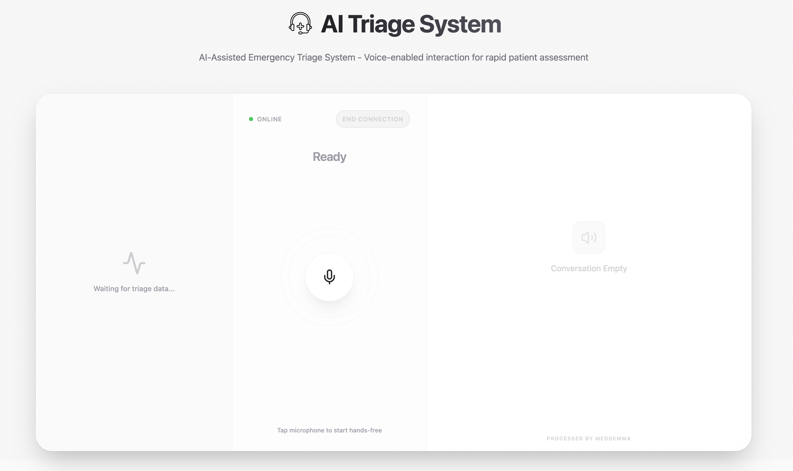
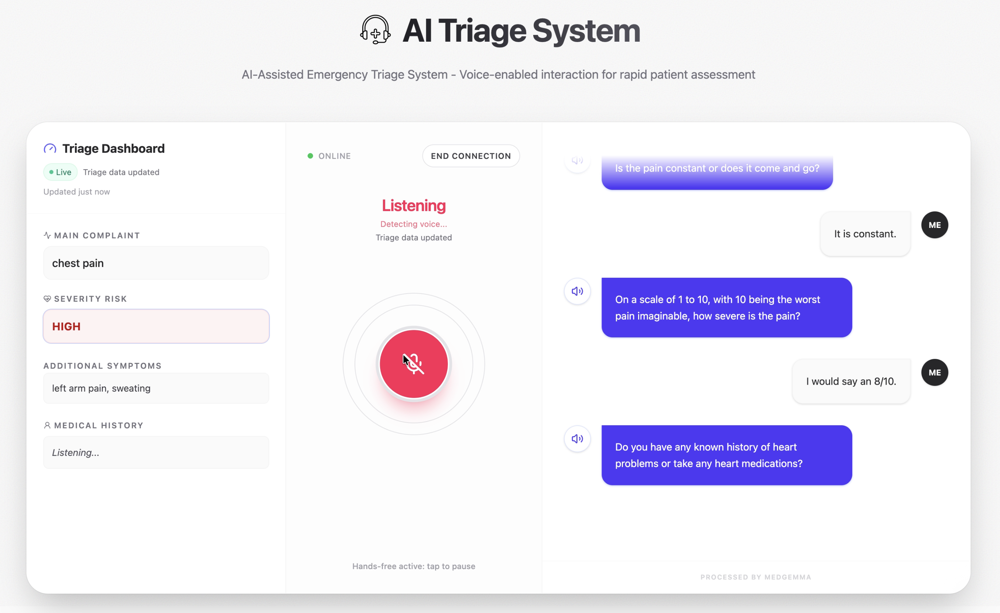

# TriageKeep

AI-assisted voice triage prototype for the MedGemma Impact Challenge.

## Architecture

- `frontend/` (Next.js 16): dispatcher UI for audio controls, transcript, extraction dashboard, final report, and FHIR export.
- `backend/` (FastAPI): HTTP APIs, websocket session handling, static audio hosting, and the voice pipeline runtime.
- `backend/voice_agent/`: modular agent system.
  - STT: MedASR (`torch` or `mlx` backend)
  - LLM: MedGemma via llama.cpp
  - TTS: Kokoro-82M
- Runtime flow:
  - `Audio -> STT -> interaction -> incremental extraction -> TTS -> websocket events`
  - `END_SESSION` signal in agent text triggers final report generation events.

- Detailed technical architecture: [docs/technical-architecture.md](docs/technical-architecture.md)

## API Overview

- `GET /`: health/status.
- `POST /analyze`: single-turn interaction response.
- `POST /extract`: extraction envelope `{ success, data, error }`.
- `POST /report`: report envelope `{ success, data, error }`.
- `POST /report/fhir`: FHIR Bundle envelope `{ success, data, error }`.
- `POST /transcribe`: file upload transcription.
- `POST /synthesize`: text-to-speech (WAV response).
- `WS /ws/audio`: real-time audio + text/event stream.

## Quick Start

### Backend

1. Download the **MedGemma 27B GGUF** model file and place it in `backend/models/` (example: `backend/models/medgemma-27b-it-Q3_K_M.gguf`).

2. Configure env:

```bash
cd backend
cp .env.example .env
```

Set `MEDGEMMA_GGUF_PATH` in `.env` to that file path, for example:

```bash
MEDGEMMA_GGUF_PATH=/absolute/path/to/triage-keep/backend/models/medgemma-27b-it-Q3_K_M.gguf
```

3. Install and run:

```bash
uv sync
PYTHONPATH=. uv run python main.py
```

Backend default: `http://127.0.0.1:8000`.

### Frontend

```bash
cd frontend
npm install
BACKEND_ORIGIN=http://127.0.0.1:8000 npm run dev
```

Frontend default: `http://localhost:3000`.

### Interaction Mode

Set `NEXT_PUBLIC_VOICE_INTERACTION_MODE` in `frontend/.env.local`:

- `ptt` (default): tap mic to start and tap again to stop/commit.
- `auto_turn`: hands-free turn commit using in-browser VAD and cooldown guards.

## Demo Runbook

1. Start backend and frontend.
2. Open `http://localhost:3000` and verify status becomes `Online`.
3. Speak a short triage scenario.
4. Confirm transcript, extraction updates, and assistant audio playback.
5. Click `End Connection` to generate the final report.
6. Optionally export the report to FHIR JSON.
7. Click `Start New Conversation` to reset.

## Demo Assets

- Demo video: [docs/triage-keep_demo.mp4](docs/triage-keep_demo.mp4)
- Startup screenshot: 
- UI screenshot: 

## Quality Gates

### Backend

```bash
cd backend
PYTHONPATH=. uv run pytest -q
```

### Frontend

```bash
cd frontend
npm run lint
```

## Safety

See `docs/safety_guardrails.md` for non-diagnostic behavior, escalation rules, and secure configuration requirements.
