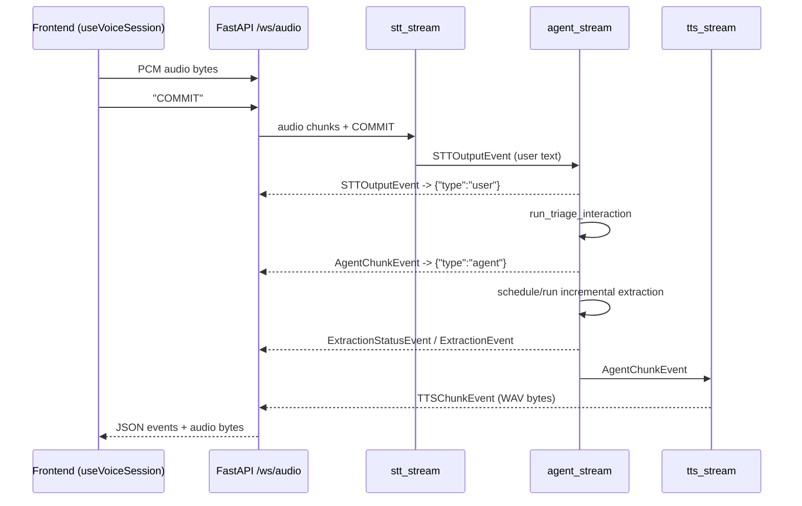
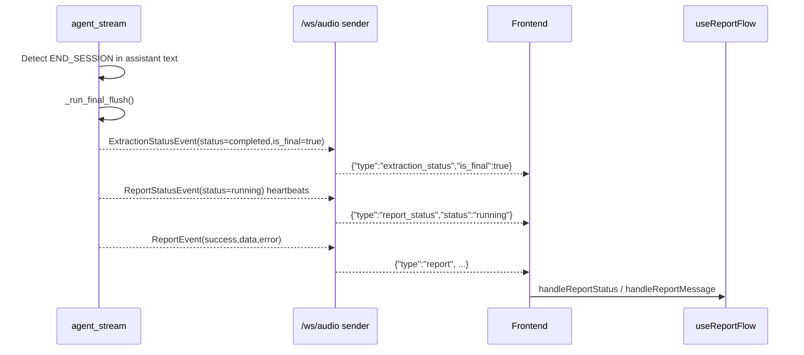

# TriageKeep Technical Architecture (As-Built)

This document captures the current implementation (as of February 22, 2026) and explains why key technical decisions were made, how they are implemented, and which tradeoffs are currently accepted.

Scope:
- Current code behavior only (no speculative design).
- Explicit implementation references for engineering review.
- Focus on runtime architecture, contracts, reliability controls, and limitations.

Path format:
- Primary: repository-relative path (for readability).
- Secondary: absolute path in parentheses (for traceability).

## 1. Purpose and Scope

### Decision Card: Documentation Strategy
- Decision: Maintain one implementation-first technical architecture document that complements existing quick-start and safety docs.
- Why this was chosen: Existing docs provide setup and high-level context, but implementation decisions are spread across backend, frontend, and tests.
- How it is implemented: This document ties each decision to source files and tests and avoids introducing behavior not present in code.
- Tradeoffs / limitations: This document must be maintained alongside code changes to remain accurate.
- References:
  - `triage-keep/README.md` 
  - `triage-keep/backend/README.md` 
  - `triage-keep/backend/voice_agent/README.md` 
  - `triage-keep/docs/safety_guardrails.md` 

## 2. System Overview

### Decision Card: Two-App Architecture (Next.js + FastAPI)
- Decision: Split UI and AI runtime into separate frontend and backend applications.
- Why this was chosen: UI iteration, browser audio handling, and AI/model runtime concerns have different dependencies and scaling characteristics.
- How it is implemented:
  - Frontend: Next.js app for dispatcher UI and browser-side audio/WebSocket session handling.
  - Backend: FastAPI app exposing HTTP endpoints and `/ws/audio` for full-duplex streaming.
  - Shared contracts are represented through HTTP envelopes and websocket event payloads.
- Tradeoffs / limitations:
  - Cross-origin configuration and routing complexity.
  - End-to-end behavior depends on protocol compatibility across both apps.
- References:
  - `triage-keep/frontend/src/app/page.tsx` 
  - `triage-keep/frontend/next.config.ts` 
  - `triage-keep/backend/main.py` 
  - `triage-keep/backend/app_factory.py` 

### Decision Card: Event-Driven Voice Pipeline
- Decision: Model the runtime as an event stream (`STT -> Agent -> TTS`) instead of monolithic request/response control flow.
- Why this was chosen: Streaming supports low-latency feedback, parallel extraction updates, and final report lifecycle events over the same session.
- How it is implemented:
  - `voice_agent_pipeline` composes `stt_stream`, `agent_stream`, and `tts_stream`.
  - WebSocket sender maps typed events to text JSON or binary WAV frames.
  - Frontend parses these messages and updates UI panels incrementally.
- Tradeoffs / limitations:
  - Event ordering and state transitions are harder to reason about than synchronous HTTP-only flows.
  - Requires strict client/server contract discipline.
- References:
  - `triage-keep/backend/voice_agent/pipelines/triage_pipeline.py` 
  - `triage-keep/backend/routes/ws.py` 
  - `triage-keep/frontend/src/hooks/useVoiceSession.ts` 

## 3. Runtime Architecture

### Decision Card: Commit-Based Turn Finalization
- Decision: Final STT turn processing is triggered by explicit `COMMIT` control message.
- Why this was chosen: Keeps server-side turn boundaries deterministic and compatible with both push-to-talk and client-side auto-turn VAD.
- How it is implemented:
  - Frontend sends PCM audio bytes continuously while recording.
  - Frontend sends `COMMIT` on manual stop or auto-turn VAD.
  - Backend STT stream transcribes buffered audio when `COMMIT` is received and emits `STTOutputEvent`.
- Tradeoffs / limitations:
  - Missed or duplicated commits impact turn timing.
  - Partial transcript events exist but are disabled in the composed pipeline.
- References:
  - `triage-keep/frontend/src/hooks/useVoiceSession.ts` 
  - `triage-keep/backend/routes/ws_shared.py` 
  - `triage-keep/backend/voice_agent/services/stt/stream.py` 
  - `triage-keep/backend/voice_agent/pipelines/triage_pipeline.py` 

### Decision Card: End-of-Session via Model Signal + Final Flush
- Decision: End-session behavior is triggered by a configurable signal token in assistant text (default `END_SESSION`) and finalized in agent runtime.
- Why this was chosen: Reuses conversational interaction while enabling report generation without introducing a separate websocket command.
- How it is implemented:
  - Agent strips signal from user-visible response and sets `end_session_requested`.
  - Runtime performs final extraction flush.
  - Emits final extraction status (`is_final=true`), then report status heartbeats and report envelope.
- Tradeoffs / limitations:
  - End session depends on model output containing the configured signal.
  - Requires robust frontend handling for websocket close-before-report scenarios.
- References:
  - `triage-keep/backend/voice_agent/agents/triage/agent.py` 
  - `triage-keep/backend/routes/ws.py` 
  - `triage-keep/frontend/src/hooks/useVoiceSession.ts` 
  - `triage-keep/frontend/src/hooks/useReportFlow.ts` 

## 4. Backend Design

### Decision Card: App Startup Warms Service Singletons
- Decision: Initialize shared services during FastAPI startup lifespan.
- Why this was chosen: Fails fast on missing model/config errors and avoids first-request cold-start behavior.
- How it is implemented:
  - `create_app()` defines lifespan.
  - `get_services()` called on startup.
  - HTTP and websocket routers are mounted from `main.py`.
- Tradeoffs / limitations:
  - Startup time increases due to model loading.
  - Service singleton lifecycle is process-local.
- References:
  - `triage-keep/backend/app_factory.py` 
  - `triage-keep/backend/main.py` 
  - `triage-keep/backend/voice_agent/config/settings.py` 

### Decision Card: Profile-Driven Service Factory with Per-Workflow LLM Locks
- Decision: Build STT/LLM/TTS through one config factory, with optional shared/split LLM instances and dedicated locks.
- Why this was chosen: Supports local/space profiles, backend auto-selection, and thread-safe llama.cpp generation across interaction/extraction workflows.
- How it is implemented:
  - `INFERENCE_PROFILE`, `STT_BACKEND`, and `TTS_DEVICE` resolve runtime implementation.
  - `LLM_INTERACTION_SERVICE` and `LLM_EXTRACTION_SERVICE` can share or split instances.
  - `threading.RLock` guards interaction/extraction generation.
- Tradeoffs / limitations:
  - Locking serializes generation on shared model instances.
  - Singleton pattern reduces flexibility for tenant-isolated sessions.
- References:
  - `triage-keep/backend/voice_agent/config/settings.py` 
  - `triage-keep/backend/voice_agent/services/llm/medgemma_llamacpp.py` 

### Decision Card: Agent Runtime Prioritizes Interaction, Decouples Extraction
- Decision: Interaction response is generated first; extraction runs asynchronously with debounce and revision control.
- Why this was chosen: Preserves conversational responsiveness while still providing structured updates.
- How it is implemented:
  - `AgentRuntimeState` tracks chat history, extraction state, revisions, and end-session flags.
  - Debounce + pending revision logic coalesces rapid turns.
  - Status events (`scheduled`, `running`, `completed`, `timed_out`) expose extraction lifecycle.
- Tradeoffs / limitations:
  - Extraction can be stale or delayed relative to transcript updates.
  - Additional complexity from concurrent task scheduling.
- References:
  - `triage-keep/backend/voice_agent/agents/triage/agent.py` 
  - `triage-keep/backend/voice_agent/core/events.py` 
  - `triage-keep/backend/tests/test_agent_stream.py` 

### Decision Card: Report Generation Uses Structured Heartbeats and Envelope
- Decision: Report generation emits status heartbeats and final success/error envelope.
- Why this was chosen: Gives the frontend deterministic progress signaling during potentially long report runs.
- How it is implemented:
  - Agent emits `ReportStatusEvent(status="running")` at start and periodic heartbeat intervals.
  - Timeout and exception paths emit standardized failure payloads.
  - HTTP `/report` endpoint and websocket report path both use envelope pattern.
- Tradeoffs / limitations:
  - Additional UI state handling required for heartbeat and close-before-report cases.
  - Report generation still depends on extraction LLM availability/locking.
- References:
  - `triage-keep/backend/voice_agent/agents/triage/agent.py` 
  - `triage-keep/backend/routes/http.py` 
  - `triage-keep/frontend/src/hooks/useReportFlow.ts` 

### Decision Card: Deterministic Report-to-FHIR Mapping
- Decision: Convert triage report JSON into a deterministic FHIR R4 `Bundle` with lightweight structural validation.
- Why this was chosen: Provides interoperable export while keeping mapping logic transparent and auditable.
- How it is implemented:
  - `map_report_to_fhir_bundle()` builds `Patient`, `Encounter`, `Condition`, `Observation`, and `CarePlan`.
  - `validate_fhir_bundle_structure()` enforces minimal structural and reference checks.
  - `/report/fhir` returns success/error envelope and optional warnings.
- Tradeoffs / limitations:
  - Validation is structural, not full profile-level clinical conformance.
  - Uses pragmatic text fields and a placeholder extension URL for age text.
- References:
  - `triage-keep/backend/voice_agent/fhir/mapping.py` 
  - `triage-keep/backend/voice_agent/fhir/validation.py` 
  - `triage-keep/backend/routes/http.py` 

## 5. Frontend Design

### Decision Card: Hook-Centric Session Orchestration
- Decision: Keep component rendering simple and move session/report/export logic into dedicated hooks.
- Why this was chosen: Isolates volatile runtime logic (audio, websocket, retries, report flow) from UI presentation.
- How it is implemented:
  - `VoiceAgent.tsx` composes `useVoiceSession`, `useReportFlow`, and `useFhirExport`.
  - Panels (`SessionControlsPanel`, `TranscriptPanel`, `TriageDashboard`, `ReportPanel`) are mostly presentation-focused.
- Tradeoffs / limitations:
  - Runtime complexity is concentrated in hooks and requires careful state reasoning.
  - Inter-hook coordination contracts must remain stable.
- References:
  - `triage-keep/frontend/src/components/VoiceAgent.tsx` 
  - `triage-keep/frontend/src/hooks/useVoiceSession.ts` 
  - `triage-keep/frontend/src/hooks/useReportFlow.ts` 
  - `triage-keep/frontend/src/hooks/useFhirExport.ts` 

### Decision Card: Dual Interaction Modes (PTT + Auto-Turn)
- Decision: Support both `ptt` and `auto_turn` session behavior with configurable thresholds.
- Why this was chosen: PTT is reliable baseline; auto-turn improves operational speed when VAD behavior is acceptable.
- How it is implemented:
  - Auto-turn mode uses RMS thresholds, silence windows, cooldown guards, and optional barge-in.
  - Both modes feed the same websocket protocol (`bytes` + `COMMIT`).
  - Status watchdog and processing fallback timers harden UX during edge transitions.
- Tradeoffs / limitations:
  - VAD behavior is heuristic and environment-dependent.
  - Audio pipeline uses `ScriptProcessorNode`, which is legacy browser API.
- References:
  - `triage-keep/frontend/src/hooks/useVoiceSession.ts` 
  - `triage-keep/frontend/src/components/voice/types.ts` 

### Decision Card: HTTP Rewrites + Runtime WebSocket Resolution
- Decision: Route report and static requests through Next.js rewrites, while websocket URL is resolved at runtime.
- Why this was chosen: Keeps frontend API calls environment-agnostic and allows explicit backend override for split-host deployments.
- How it is implemented:
  - Rewrites in `next.config.ts`: `/report`, `/report/fhir`, `/static/:path*`.
  - `resolveWebSocketUrl()` resolves override origin, localhost fallback, then same-origin fallback.
- Tradeoffs / limitations:
  - Misconfigured env vars can route traffic to unreachable backend.
  - Different HTTP and websocket resolution paths increase configuration surface.
- References:
  - `triage-keep/frontend/next.config.ts` 
  - `triage-keep/frontend/src/lib/voice/endpoints.ts` 
  - `triage-keep/frontend/src/lib/voice/http.ts` 

## 6. Data Contracts (HTTP + WebSocket + Report/FHIR)

### Decision Card: Envelope-First HTTP Responses
- Decision: Use `success/data/error` envelopes for extraction, report, and FHIR export endpoints.
- Why this was chosen: Keeps parse and transport failures explicit and machine-actionable.
- How it is implemented:
  - `/extract`, `/report`, `/report/fhir` return structured envelopes.
  - Error codes are mapped centrally where applicable (especially report path).
- Tradeoffs / limitations:
  - Client code must handle both transport-level and envelope-level failures.
- References:
  - `triage-keep/backend/routes/http.py` 
  - `triage-keep/backend/voice_agent/core/schemas.py` 
  - `triage-keep/backend/voice_agent/core/error_mapping.py` 

### Decision Card: Typed WebSocket Event Contract
- Decision: Mix binary audio chunks and typed JSON text events on one websocket channel.
- Why this was chosen: Supports real-time voice output and structured UI updates in one session stream.
- How it is implemented:
  - Binary outbound: `TTSChunkEvent` audio bytes.
  - Text outbound: `user`, `agent`, `extraction`, `extraction_status`, `report_status`, `report`.
  - Frontend parses with `parseTextEvent` and updates session/report state.
- Tradeoffs / limitations:
  - Any unrecognized text event is ignored client-side.
  - Protocol changes require synchronized server and client updates.
- References:
  - `triage-keep/backend/routes/ws.py` 
  - `triage-keep/backend/voice_agent/core/events.py` 
  - `triage-keep/frontend/src/components/voice/types.ts` 
  - `triage-keep/frontend/src/lib/voice/protocol.ts` 

### HTTP Contract Snapshot

| Endpoint | Method | Request | Response |
|---|---|---|---|
| `/` | `GET` | none | `StatusResponse` |
| `/analyze` | `POST` | `TriageRequest` | `TriageAnalysisResponse` |
| `/extract` | `POST` | `TriageRequest` | `TriageExtractionResponse` envelope |
| `/report` | `POST` | `TriageReportRequest` | `TriageReportResponse` envelope |
| `/report/fhir` | `POST` | `FHIRExportRequest` | `FHIRExportResponse` envelope |
| `/transcribe` | `POST` | multipart audio file | `TranscriptionResponse` |
| `/synthesize` | `POST` | query param `text` | `audio/wav` bytes |

### WebSocket Contract Snapshot (`/ws/audio`)

Client -> Server:
- Binary PCM audio chunks.
- Text control messages: `COMMIT`, keepalive `PING`/`PONG`.

Server -> Client:
- Binary WAV audio chunks.
- JSON text events:
  - `{"type":"user","text":...}`
  - `{"type":"agent","text":...}`
  - `{"type":"extraction","data":{...}}`
  - `{"type":"extraction_status","status":"scheduled|running|stale_discarded|completed|timed_out","revision":n,"is_final"?:true}`
  - `{"type":"report_status","status":"running|completed|failed"}`
  - `{"type":"report","success":bool,"data":{...},"error":{...}|null}`

### Report/FHIR Contract Notes
- Report generation expects schema-shaped object including:
  - `patient_information`
  - `assessment`
  - `disposition`
  - `plan`
  - `administrative` (added server-side in report workflow)
- FHIR export expects report object and optionally includes structural validation warnings.

References:
- `triage-keep/backend/voice_agent/agents/triage/workflows.py` 
- `triage-keep/backend/voice_agent/fhir/mapping.py` 
- `triage-keep/backend/voice_agent/fhir/validation.py` 

## 7. Configuration and Environment Variables

### Decision Card: Environment-Driven Runtime Tuning
- Decision: Expose model selection, concurrency, timeouts, and protocol behavior via env vars.
- Why this was chosen: Keeps code paths stable while enabling deployment tuning per hardware/profile.
- How it is implemented:
  - Service selection and defaults in config factory.
  - LLM token/context tuning in llama.cpp adapter and workflows.
  - Agent/report/websocket timing controls in agent/main modules.
  - Frontend origin/mode selection through Next.js env vars.
- Tradeoffs / limitations:
  - Misconfiguration can degrade latency or produce runtime errors.
  - Defaults are optimized for local development patterns, not necessarily production workloads.
- References:
  - `triage-keep/backend/voice_agent/config/settings.py` 
  - `triage-keep/backend/voice_agent/services/llm/medgemma_llamacpp.py` 
  - `triage-keep/backend/voice_agent/agents/triage/agent.py` 
  - `triage-keep/backend/voice_agent/agents/triage/workflows.py` 
  - `triage-keep/backend/.env.example` 
  - `triage-keep/frontend/README.md` 
  - `triage-keep/frontend/next.config.ts` 

### Runtime Configuration Matrix

| Variable | Default | Purpose | Source |
|---|---|---|---|
| `INFERENCE_PROFILE` | platform-dependent | `local` vs `space` behavior profile | `settings.py` |
| `STT_BACKEND` | `auto` | `mlx` or `torch` STT backend selection | `settings.py` |
| `TTS_DEVICE` | `auto` | TTS device choice (`cuda/mps/cpu`) | `settings.py` |
| `LLM_SERVICE` | `medgemma_llamacpp` | default LLM implementation | `settings.py` |
| `LLM_INTERACTION_SERVICE` | inherits `LLM_SERVICE` | interaction workflow LLM | `settings.py` |
| `LLM_EXTRACTION_SERVICE` | inherits `LLM_SERVICE` | extraction/report workflow LLM | `settings.py` |
| `MEDGEMMA_GGUF_PATH` | none | required GGUF model path | `medgemma_llamacpp.py` |
| `MODEL_PATH` | none | legacy alias to seed `MEDGEMMA_GGUF_PATH` | `settings.py` |
| `MEDGEMMA_N_CTX` | `4096` | llama.cpp context window | `medgemma_llamacpp.py` |
| `MEDGEMMA_N_THREADS` | `0` | llama.cpp threads (`0` => auto) | `medgemma_llamacpp.py` |
| `MEDGEMMA_N_BATCH` | `128` | llama.cpp batch size | `medgemma_llamacpp.py` |
| `MEDGEMMA_GPU_LAYERS` | `-1` | GGUF GPU offload layers | `medgemma_llamacpp.py` |
| `MEDGEMMA_MAX_NEW_TOKENS` | `320` | global generation token cap | `medgemma_llamacpp.py` |
| `MEDGEMMA_CONTEXT_MARGIN` | `64` | prompt budget safety margin | `medgemma_llamacpp.py` |
| `MEDGEMMA_ENABLE_JSON_GRAMMAR` | `true` | enable llama grammar for JSON/schema outputs | `medgemma_llamacpp.py` |
| `MEDGEMMA_INTERACTION_MAX_NEW_TOKENS` | fallback `224` | interaction-specific output cap | `workflows.py` |
| `MEDGEMMA_EXTRACTION_MAX_NEW_TOKENS` | fallback `224` | extraction-specific output cap | `workflows.py` |
| `MEDGEMMA_REPORT_MAX_NEW_TOKENS` | fallback `256` | report-specific output cap | `workflows.py` |
| `MEDGEMMA_REPORT_MAX_CHARS` | `10000` | report chat-history truncation size | `workflows.py` |
| `MEDGEMMA_EXTRACTION_TIMEOUT_S` | `35` | incremental extraction timeout | `agent.py` |
| `MEDGEMMA_EXTRACTION_FINAL_TIMEOUT_S` | `60` | final extraction flush timeout | `agent.py` |
| `MEDGEMMA_EXTRACTION_DEBOUNCE_S` | `3` | extraction debounce delay | `agent.py` |
| `MEDGEMMA_EXTRACTION_MAX_DELTA_TURNS` | `8` | max incremental delta turns | `agent.py` |
| `MEDGEMMA_EXTRACTION_ENABLE_STATUS_EVENTS` | `true` | emit extraction status events | `agent.py` |
| `MEDGEMMA_ENABLE_EMERGENCY_RULE_GATE` | `true` | deterministic emergency bypass gate | `agent.py` |
| `MEDGEMMA_EMERGENCY_ESCALATION_MESSAGE` | built-in string | emergency response override | `agent.py` |
| `MEDGEMMA_SESSION_END_SIGNAL` | `END_SESSION` | end-session marker in assistant output | `agent.py` |
| `MEDGEMMA_REPORT_AUTO_TIMEOUT_S` | `90` | report generation timeout | `agent.py` |
| `MEDGEMMA_REPORT_STATUS_HEARTBEAT_S` | `2` | report running heartbeat cadence | `agent.py` |
| `MEDGEMMA_REPORT_HTTP_LOCK_TIMEOUT_S` | `3.0` | HTTP `/report` lock acquisition timeout | `http.py` |
| `MEDGEMMA_WS_PING_INTERVAL_S` | `60` | uvicorn websocket keepalive interval | `main.py` |
| `MEDGEMMA_WS_PING_TIMEOUT_S` | `120` | uvicorn websocket keepalive timeout | `main.py` |
| `BACKEND_ORIGIN` | `http://127.0.0.1:8000` | Next.js rewrite destination | `next.config.ts` |
| `NEXT_PUBLIC_BACKEND_ORIGIN` | unset | client-side websocket origin override | `endpoints.ts` |
| `NEXT_PUBLIC_VOICE_INTERACTION_MODE` | `ptt` | frontend interaction mode | `VoiceAgent.tsx` |

## 8. Safety and Reliability Decisions

### Decision Card: Deterministic Emergency Rule Gate Before LLM Interaction
- Decision: Run lightweight rule-based emergency detection on each user turn and bypass LLM interaction when triggered.
- Why this was chosen: Reduces dependence on model generation for high-risk escalation triggers.
- How it is implemented:
  - `evaluate_emergency_trigger()` checks phrase rules with basic negation handling.
  - Agent emits fixed escalation message and marks interaction latency status as bypassed.
  - Gate can be disabled by env var for controlled testing/experiments.
- Tradeoffs / limitations:
  - Rule coverage is finite and phrase-based.
  - False negatives are possible for paraphrases outside defined rule phrases.
- References:
  - `triage-keep/backend/voice_agent/agents/triage/safety_rules.py` 
  - `triage-keep/backend/voice_agent/agents/triage/agent.py` 
  - `triage-keep/backend/tests/test_safety_rules.py` 
  - `triage-keep/backend/tests/test_agent_stream.py` 

### Decision Card: Output Validation and Structured Failure Mapping
- Decision: Treat model output as untrusted and normalize failures into stable error payloads.
- Why this was chosen: Prevents malformed JSON leaking into downstream APIs/UI and provides actionable error semantics.
- How it is implemented:
  - Extraction/report parsing validates JSON object shape.
  - Report error payloads use centralized code classification.
  - FHIR export path validates required report keys and optional structural checks.
- Tradeoffs / limitations:
  - Some failures still collapse into generic runtime error categories.
  - Validation is pragmatic and schema-scoped, not full semantic clinical validation.
- References:
  - `triage-keep/backend/routes/http.py` 
  - `triage-keep/backend/voice_agent/core/error_mapping.py` 
  - `triage-keep/backend/voice_agent/fhir/validation.py` 
  - `triage-keep/docs/safety_guardrails.md` 

### Decision Card: Session Resilience Controls
- Decision: Combine websocket keepalive, reconnect policy, watchdog timers, and close-handling safeguards.
- Why this was chosen: Improves robustness in long-running voice sessions with variable network/browser behavior.
- How it is implemented:
  - Server handles websocket disconnect/send-close patterns defensively.
  - Frontend sends periodic `PING`, retries websocket connect, and emits report failure if closed before final report.
  - Runtime watchdog logs inconsistent state transitions.
- Tradeoffs / limitations:
  - Reconnect policy is simple fixed-delay behavior.
  - No durable session resume across reconnects.
- References:
  - `triage-keep/backend/routes/ws_shared.py` 
  - `triage-keep/backend/main.py` 
  - `triage-keep/frontend/src/hooks/useVoiceSession.ts` 

## 9. Observability and Error Handling

### Decision Card: Structured JSON Logging with Session/Turn Context
- Decision: Emit structured JSON logs for all runtime events with session and turn metadata.
- Why this was chosen: Improves traceability across asynchronous STT/agent/TTS stages.
- How it is implemented:
  - `log_event()` and `log_latency_event()` serialize JSON payloads with `component`, `event`, `session_id`, `turn_id`, and details.
  - Session metrics are accumulated and emitted as summary at websocket teardown.
- Tradeoffs / limitations:
  - Logs are stdout-based; persistence/indexing is external to this repo.
  - Correlation across process boundaries is not implemented.
- References:
  - `triage-keep/backend/voice_agent/core/logging_utils.py` 
  - `triage-keep/backend/routes/ws_shared.py` 
  - `triage-keep/backend/tests/test_structured_logging.py` 
  - `triage-keep/backend/tests/test_latency_metrics_logging.py` 

### Decision Card: Error Taxonomy Normalization
- Decision: Normalize report and LLM failure causes to stable error codes.
- Why this was chosen: Keeps API behavior consistent for frontend and test assertions across diverse runtime failure messages.
- How it is implemented:
  - LLM adapter maps context/decode errors to typed exceptions.
  - HTTP/report paths map failures into code/message/details payloads.
  - Busy lock behavior returns explicit `LLM_BUSY` code.
- Tradeoffs / limitations:
  - Some low-level model/backend errors still require log inspection for root cause.
  - Error granularity is intentionally limited for API stability.
- References:
  - `triage-keep/backend/voice_agent/services/llm/base.py` 
  - `triage-keep/backend/voice_agent/services/llm/medgemma_llamacpp.py` 
  - `triage-keep/backend/voice_agent/core/error_mapping.py` 
  - `triage-keep/backend/routes/http.py` 
  - `triage-keep/backend/tests/test_error_mapping.py` 
  - `triage-keep/backend/tests/test_llm_contract.py` 

## 10. Testing Strategy and Coverage Map

### Decision Card: Behavior-Driven Backend Tests Across Contracts and Pipeline Stages
- Decision: Test critical runtime behaviors at API, websocket, pipeline, workflow, safety, logging, and mapping layers.
- Why this was chosen: Architecture is integration-heavy and event-driven; regressions often appear at boundaries.
- How it is implemented:
  - API contract and error-envelope tests.
  - Websocket event sequence tests.
  - Agent stream ordering, debounce, timeout, emergency gate, and report heartbeat tests.
  - FHIR mapping/validation, LLM adapter contract, and logging schema tests.
- Tradeoffs / limitations:
  - Frontend automated test coverage is not present in this repository.
  - Some performance/quality scripts are exploratory and not CI gates.
- References:
  - `triage-keep/backend/tests/test_api.py` 
  - `triage-keep/backend/tests/test_websocket.py` 
  - `triage-keep/backend/tests/test_agent_stream.py` 
  - `triage-keep/backend/tests/test_pipeline.py` 
  - `triage-keep/backend/tests/test_fhir_mapping_from_report.py` 
  - `triage-keep/backend/tests/test_safety_rules.py` 
  - `triage-keep/backend/tests/test_latency_metrics_logging.py` 
  - `triage-keep/backend/tests/test_llm_contract.py` 

### Coverage Map by Domain

| Domain | Key Behaviors Validated | Primary Tests |
|---|---|---|
| HTTP API contracts | endpoint response shapes, envelope semantics, error mapping | `test_api.py`, `test_error_mapping.py` |
| WebSocket protocol | bytes/text flow and event order | `test_websocket.py`, `test_ws_shared.py` |
| Agent orchestration | interaction-first order, debounce, timeout, finalization, report heartbeats | `test_agent_stream.py`, `test_agent_v2.py` |
| Pipeline composition | STT -> Agent -> TTS chaining | `test_pipeline.py`, `test_tts_stream.py`, `test_stt_stream.py` |
| Safety gate | deterministic trigger/negation behavior | `test_safety_rules.py` |
| FHIR export | mapping completeness and structural validity | `test_fhir_mapping_from_report.py` |
| LLM adapter behavior | options propagation, grammar usage, error normalization | `test_llm_contract.py`, `test_workflows_options.py` |
| Observability | structured logs and latency events | `test_structured_logging.py`, `test_latency_metrics_logging.py` |

## 11. Known Limitations and Tradeoffs

### Decision Card: Current Constraints Are Explicitly Accepted for MVP Scope
- Decision: Keep implementation pragmatic and document constraints directly in architecture and tests.
- Why this was chosen: The project prioritizes demonstrable end-to-end triage flow with clear operational guardrails.
- How it is implemented: The following limitations are visible in source/test behavior and are intentionally not hidden.
- Tradeoffs / limitations: These constraints should be addressed before production-grade rollout.
- References:
  - `triage-keep/backend/app_factory.py` 
  - `triage-keep/backend/voice_agent/services/stt/stream.py` 
  - `triage-keep/frontend/src/hooks/useVoiceSession.ts` 
  - `triage-keep/backend/voice_agent/fhir/validation.py` 

### Limitation Register

| Limitation | Impact | Evidence |
|---|---|---|
| Open CORS policy (`allow_origins=["*"]`) | Safe for demos/dev, too permissive for production internet exposure | `backend/app_factory.py` |
| No auth/authorization layer on APIs or websocket | Any reachable client can call runtime endpoints | `backend/routes/http.py`, `backend/routes/ws.py` |
| STT pipeline is commit-driven and partial transcripts are disabled in composed runtime | Less granular live transcript updates during active speech | `backend/voice_agent/pipelines/triage_pipeline.py`, `backend/voice_agent/services/stt/stream.py` |
| STT and TTS stream inference each use single-worker thread executors | Throughput is constrained per process; long tasks can queue | `backend/voice_agent/services/stt/stream.py`, `backend/voice_agent/services/tts/stream.py` |
| End-session depends on signal token in model output (`END_SESSION` by default) | Report lifecycle initiation can be affected by generation behavior or prompt drift | `backend/voice_agent/agents/triage/agent.py` |
| FHIR validation is structural only (not complete profile conformance) | Bundle may pass local checks but still fail external profile validators | `backend/voice_agent/fhir/validation.py` |
| Browser capture uses `ScriptProcessorNode` | Works today but is a legacy API and not ideal long-term | `frontend/src/hooks/useVoiceSession.ts` |
| Frontend test automation is not present in repo | UI regressions rely on manual checks and backend contract stability | `frontend/` tree has no test suite files |

## 12. Appendix: File Reference Index

This index lists the primary files referenced by architecture decisions.

### Entrypoints and Lifecycle
- `triage-keep/backend/main.py` 
- `triage-keep/backend/app_factory.py` 

### API and WebSocket Contracts
- `triage-keep/backend/routes/http.py` 
- `triage-keep/backend/routes/ws.py` 
- `triage-keep/backend/routes/ws_shared.py` 
- `triage-keep/backend/voice_agent/core/schemas.py` 
- `triage-keep/frontend/src/components/voice/types.ts` 

### Pipeline and Orchestration
- `triage-keep/backend/voice_agent/pipelines/triage_pipeline.py` 
- `triage-keep/backend/voice_agent/agents/triage/agent.py` 
- `triage-keep/backend/voice_agent/agents/triage/workflows.py` 
- `triage-keep/backend/voice_agent/core/events.py` 

### Model and Service Integrations
- `triage-keep/backend/voice_agent/config/settings.py` 
- `triage-keep/backend/voice_agent/services/stt/stream.py` 
- `triage-keep/backend/voice_agent/services/stt/medasr.py` 
- `triage-keep/backend/voice_agent/services/stt/medasr_mlx.py` 
- `triage-keep/backend/voice_agent/services/llm/medgemma_llamacpp.py` 
- `triage-keep/backend/voice_agent/services/tts/stream.py` 
- `triage-keep/backend/voice_agent/services/tts/kokoro.py` 

### Frontend Session and State Architecture
- `triage-keep/frontend/src/hooks/useVoiceSession.ts` 
- `triage-keep/frontend/src/components/VoiceAgent.tsx` 
- `triage-keep/frontend/src/hooks/useReportFlow.ts` 
- `triage-keep/frontend/src/hooks/useFhirExport.ts` 
- `triage-keep/frontend/next.config.ts` 
- `triage-keep/frontend/src/lib/voice/endpoints.ts` 

### Safety, FHIR, Logging, Error Mapping
- `triage-keep/backend/voice_agent/agents/triage/safety_rules.py` 
- `triage-keep/backend/voice_agent/fhir/mapping.py` 
- `triage-keep/backend/voice_agent/fhir/validation.py` 
- `triage-keep/backend/voice_agent/core/logging_utils.py` 
- `triage-keep/backend/voice_agent/core/error_mapping.py` 
- `triage-keep/docs/safety_guardrails.md` 

### Dependency and Runtime Declarations
- `triage-keep/backend/pyproject.toml` 
- `triage-keep/frontend/package.json` 
- `triage-keep/backend/.env.example` 

### Test Coverage Map Files
- `triage-keep/backend/tests/test_api.py` 
- `triage-keep/backend/tests/test_websocket.py` 
- `triage-keep/backend/tests/test_agent_stream.py` 
- `triage-keep/backend/tests/test_pipeline.py` 
- `triage-keep/backend/tests/test_fhir_mapping_from_report.py` 
- `triage-keep/backend/tests/test_safety_rules.py` 
- `triage-keep/backend/tests/test_latency_metrics_logging.py` 
- `triage-keep/backend/tests/test_llm_contract.py` 

