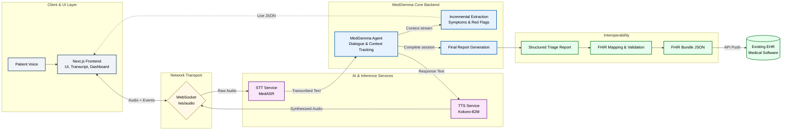

# Kaggle Submission Writeup

### Project name
TriageKeep: Real-Time MedGemma Voice Triage Copilot

### Your team
Mariana Coelho - AI Engineer

### Problem statement
At the front door of urgent care, minutes matter. A dispatcher or triage nurse is listening for danger signals while also documenting symptoms, onset, severity, and history. In practice, that first contact is often a free-form conversation plus manual notes. Important details can be missed, structure arrives late, and data is re-entered downstream.

TriageKeep was built for this exact moment. It is not a generic chatbot. It is a safety-first, human-in-the-loop intake workflow that:

- listens to natural voice conversation,
- continuously structures medical information during the call,
- highlights red-flag context for operator awareness,
- generates a handoff-ready final report,
- and exports FHIR-compatible JSON for interoperability.

The goal is simple: improve first-contact triage quality and speed without removing human clinical oversight.

#### Who the user is and how the journey changes
Primary users are triage nurses, dispatch operators, and intake clinicians. Secondary users are health systems that need interoperable outputs.

Before TriageKeep:
- free-form intake calls,
- manual note-taking under pressure,
- delayed structured summary after the conversation,
- duplicate entry into EHR or triage systems.

With TriageKeep:
- live voice interaction with auto-turn support,
- continuous on-screen extraction of key triage entities,
- one-click final structured report generation,
- FHIR Bundle JSON export for downstream integration.

#### Impact potential
In emergency call centers, urgent-care front desks, and telehealth intake, this workflow can improve both operational speed and safety awareness:

- faster first-pass intake with less note-taking overhead,
- earlier visibility of severe symptom patterns via live extraction,
- higher report completeness at handoff,
- lower integration friction through standards-based output,
- better pre-clinician routing and queue prioritization.

Impact is measured as operational KPIs, not only model benchmarks:

- Intake efficiency: time from call start to completed triage summary.
- Triage quality: completeness of required fields (complaint, onset, severity, associated symptoms, history, risk level).
- Safety responsiveness: recall of escalation triggers for severe patterns.
- Workflow adoption: percentage of sessions marked usable by operators.

### Overall solution
TriageKeep is an end-to-end voice triage pipeline built around HAI-DEF models, with MedGemma as the core medical reasoning engine.

#### Story of one triage session (end-to-end)
1. A patient speaks naturally. The system captures audio in real time.
2. MedASR transcribes the conversation with medical vocabulary awareness.
3. MedGemma drives the interview flow, asks focused follow-ups, and tracks context.
4. In parallel, extraction workflows keep a live structured triage state on screen.
5. At session end, MedGemma generates a clinician-friendly structured report.
6. The report is mapped and validated into a FHIR Bundle for handoff to existing health software.
7. The human operator reviews outputs before any downstream action.

This narrative flow is the product: conversational intake, structured understanding, safe review, and interoperable transfer.

#### Architecture schema

#### Why HAI-DEF models are essential here (Effective use of HAI-DEF models)
This project depends on medical-language understanding and clinically coherent follow-up behavior. HAI-DEF models are used at the points where domain grounding matters most:

1. MedGemma interaction engine: context-aware, triage-focused questioning during the live interview.
2. MedGemma extraction workflows: continuous structured updates of symptoms, risk factors, and red flags.
3. MedGemma report synthesis: final structured report suitable for clinical handoff.
4. Domain speech stack: MedASR for medical STT and Kokoro-based TTS for low-latency voice response.

Why this is better than a generic stack:
- generic STT is more error-prone on medical terminology,
- generic LLM reasoning is less reliable for triage escalation context,
- post-processing burden grows when medical structure is not native to the model behavior,
- interoperability outputs become more brittle without domain-aware intermediate structure.

#### Core use cases implemented in this repository
1. STT -> MedGemma interaction -> TTS live voice loop.
2. Auto-turn conversation with VAD (plus push-to-talk fallback).
3. Real-time extraction dashboard for operator situational awareness.
4. End-session structured triage report generation.
5. FHIR conversion/export for EHR and health-system integration.

### Technical details
#### Product feasibility
This is a deployable full-stack application, not only an offline notebook demonstration.

- Frontend: Next.js interface with transcript, live dashboard, controls, and report panel.
- Backend: FastAPI services with WebSocket voice/event streaming.
- Model serving:
  - STT: `google/medasr`
  - LLM: MedGemma via `llama.cpp` (GGUF runtime)
  - TTS: Kokoro-82M
- Streaming endpoint: `/ws/audio`.
- Structured APIs: `/extract`, `/report`, `/transcribe`, `/synthesize`, `/analyze`.

The architecture is modular: STT, LLM, and TTS run as separable services, supporting hardware-aware scaling and future component swaps.

#### Model adaptation and tuning
- MedGemma is served locally through `llama.cpp` GGUF for practical latency and cost.
- Adaptation is workflow-level in this MVP: prompt design plus schema-constrained extraction/report generation.
- Deterministic validation layers are used before emitting structured outputs.
- Quantized runtimes improve deployment feasibility on constrained hardware.
- Planned next step: LoRA fine-tuning on curated triage dialogues and institution-specific terminology.

#### Safety and clinical workflow alignment
TriageKeep is decision support, not diagnosis automation.

- Non-diagnostic behavior is enforced by guardrails.
- Severe symptom patterns are escalated conservatively.
- Parsing and output paths return explicit success/error envelopes.
- Human operators review transcript, extraction, and final report before action.

#### Performance analysis protocol
Readiness is evaluated at the workflow level:

- Voice UX latency: P95 end-of-speech to first assistant audio chunk.
- Conversation robustness: false commits, missed commits, barge-in success.
- Clinical data quality: required-field completeness and extraction consistency.
- Safety behavior: escalation recall in red-flag scenarios.
- Operational reliability: session-fatal error rate and usable-session rate.

This aligns evaluation with real triage operations rather than isolated model tests.

#### Latency and conversation robustness
Real-time voice quality depends on both speed and turn control. TriageKeep includes explicit safeguards for this:

- Turn latency instrumentation:
  - frontend logs first assistant audio chunk per turn (`assistant_first_audio_chunk`),
  - backend logs TTS stage latency (`tts_latency`),
  - pilot KPI remains P95 end-of-speech -> first assistant audio chunk.
- Barge-in handling in auto-turn mode:
  - if user speech starts while assistant audio is playing, VAD triggers `barge_in_triggered`,
  - current playback is stopped immediately, queued audio is cleared, and status returns to listening.
- Turn-collision protection:
  - commit cooldown prevents duplicate turn commits,
  - post-playback holdoff avoids premature re-commit loops.
- Runtime resilience:
  - processing watchdog/fallback recovers from delayed responses,
  - websocket keepalive and reconnect logic reduce session drops.

#### Reproducibility environment
All reported behavior was produced on:

- Hardware: MacBook Pro (Apple M4 Pro, 14 CPU cores), 48 GB RAM.
- OS: macOS 26.2 (Build 25C56).
- Python: 3.12.11 (`project requires >=3.11`).
- Node.js: v22.13.1.
- Package/runtime manager: `uv 0.9.3`.
- Backend stack: FastAPI, Uvicorn, `llama-cpp-python`, transformers.
- Frontend stack: Next.js 16.1.4, React 19.2.3.
- LLM runtime artifacts:
  - `medgemma-1.5-4b-it-Q8_0.gguf` (local quantized runtime),
  - `medgemma-27b-it-Q3_K_M.gguf` (local quantized runtime).
- Speech models/services:
  - STT: `google/medasr`,
  - TTS: Kokoro-82M.

Latency and throughput will vary with different hardware and deployment topology.

#### Deployment challenges and mitigation plan
- Challenge: latency variance across hardware.
  Mitigation: quantized runtimes, modular scaling, websocket keepalive tuning.
- Challenge: safe behavior with incomplete/noisy input.
  Mitigation: conservative escalation, parse validation, mandatory human review.
- Challenge: integration with existing clinical systems.
  Mitigation: FHIR mapping/validation and exportable Bundle artifacts.
- Challenge: operational adoption.
  Mitigation: dual interaction modes (`ptt`, `auto_turn`) and pilot gates before default rollout.

### MVP status and path to production
This submission is an MVP proving end-to-end feasibility. A production deployment is realistic, but requires focused hardening in five areas:

- Clinical safety validation: prospective pilot, clinician-reviewed labels, and explicit acceptance thresholds by risk tier.
- Security/compliance baseline: encryption, RBAC, PHI minimization, retention controls, and mapped HIPAA/GDPR procedures.
- Reliability/SRE: SLOs for latency and availability, autoscaling + backpressure, on-call runbooks, and failure drills.
- Interoperability rollout: broader FHIR resource coverage and site-specific mapping profiles for target EHRs.
- MLOps governance: continuous evaluation, drift monitoring, and controlled prompt/model version rollback.

### Why this solution is compelling
TriageKeep is compelling because it closes the full loop from first voice contact to interoperable clinical handoff:

- voice intake,
- domain-grounded reasoning,
- continuous structured extraction,
- safety-aware reporting,
- and FHIR-compatible export.

That complete pathway is what makes this system practical for real healthcare workflows.
