# Kaggle Submission Writeup

### Project name
TriageKeep: Real-Time MedGemma Voice Triage Copilot

### Your team
Mariana Coelho - AI Engineer

### Problem statement
Emergency and urgent-care triage is a high-impact bottleneck: clinicians and dispatchers must collect critical information quickly, while under pressure and with incomplete patient narratives. In many settings, this intake is still manual and fragmented, causing:

- delayed risk stratification,
- inconsistent data capture,
- increased administrative burden,
- and poor interoperability with downstream systems.

The unmet need is not just "chat with a model"; it is a clinically usable intake workflow that can handle natural voice conversation, continuously structure data, and produce handoff-ready outputs for existing medical software.

TriageKeep addresses this with a safety-first, human-in-the-loop triage copilot that captures patient information through voice, structures it in real time, and produces both a final report and FHIR-ready output.
It can operate 24/7 as an always-available intake assistant, helping perform proper triage before a patient reaches a doctor and reducing misrouted or inappropriate appointment bookings.

#### Who the user is and improved journey
Primary users are triage nurses, dispatch operators, and intake clinicians. Secondary users are health systems that need interoperable triage outputs.

Before TriageKeep:
- free-form conversation,
- manual note-taking during calls,
- delayed structured summary,
- duplicate data entry in downstream software.

With TriageKeep:
- live voice conversation with auto-turn support,
- continuous structured extraction on screen,
- one-click final report generation,
- FHIR JSON export for integration with existing systems.

#### Impact potential
If deployed in call centers, emergency intake desks, and telehealth front doors, TriageKeep can improve both speed and quality of first contact:

- Faster first-pass intake through hands-free conversation.
- Earlier visibility of red-flag symptoms through live extraction.
- Reduced documentation load via auto-generated structured reports.
- Lower integration friction by exporting interoperable FHIR bundles.
- Better patient routing before clinician contact, reducing wrong appointment allocation and improving queue prioritization.

Our impact model is measurable and operational:

- Intake efficiency: average minutes from call start to complete triage summary.
- Triage quality: completeness rate of required fields (complaint, onset, severity, associated symptoms, history, risk level).
- Safety responsiveness: escalation trigger recall for severe symptom patterns.
- Workflow adoption: percentage of sessions marked usable by operators.

### Overall solution
TriageKeep is a multimodal, real-time pipeline built around HAI-DEF models, with MedGemma as the core clinical reasoning component.

#### Architecture schema

```mermaid
flowchart LR
    %% Logical Layers using Subgraphs
    subgraph ClientLayer [Client & UI Layer]
        A([🗣️ Patient Voice]) --> B[💻 Next.js Frontend<br/>UI, Transcript, Dashboard]
    end
    subgraph Delivery [Network Transport]
        C{🔌 WebSocket<br/>/ws/audio}
    end
    subgraph AI [AI & Inference Services]
        D[[🎙️ STT Service<br/>MedASR]]
        H[[🔊 TTS Service<br/>Kokoro-82M]]
    end
    subgraph Logic [MedGemma Core Backend]
        E(🧠 MedGemma Agent<br/>Dialogue & Context Tracking)
        F[📊 Incremental Extraction<br/>Symptoms & Red Flags]
        I[📝 Final Report Generation]
    end
    subgraph Export [Interoperability]
        J[/📄 Structured Triage Report/]
        K[🔄 FHIR Mapping & Validation]
        L[/📦 FHIR Bundle JSON/]
    end
    M[(🏥 Existing EHR /<br/>Medical Software)]
    %% Core Data Flow
    B <-->|Bidirectional Audio & Events| C
    C -->|Raw Audio| D
    D -->|Transcribed Text| E
    %% Audio Response Path
    E -->|Response Text| H
    H -->|Synthesized Audio| C
    %% Live Dashboard Data Path
    E -->|Continuous Context| F
    F -.->|Live JSON Updates| B
    %% Final Output Path
    E -->|Session Completion| I
    I --> J
    J --> K
    K --> L
    L -->|API Push| M
    %% Theming / Styling - Explicit text color (#000000) added for GitHub Dark Mode compatibility!
    classDef client fill:#f0f4f8,stroke:#334e68,stroke-width:2px,color:#000000;
    classDef transport fill:#fff8e6,stroke:#b19039,stroke-width:2px,color:#000000;
    classDef brain fill:#e6f2ff,stroke:#005bb5,stroke-width:2px,color:#000000;
    classDef model fill:#fae6fa,stroke:#7b3294,stroke-width:2px,color:#000000;
    classDef system fill:#e6ffed,stroke:#1e7e34,stroke-width:2px,color:#000000;
    class A,B client;
    class C transport;
    class E,F,I brain;
    class D,H model;
    class J,K,L,M system;
```

#### Why HAI-DEF models are essential here (Effective use of HAI-DEF models)
This use case requires medical-domain language understanding, structured reasoning, and safe communication patterns. Generic LLM pipelines are weaker for this context. TriageKeep uses HAI-DEF models where they matter most:

1. Medical interaction engine (MedGemma): drives patient interview turns and context-aware follow-up questions.
2. Incremental medical entity extraction (MedGemma workflows): continuously updates structured triage fields during conversation.
3. Final report generation (MedGemma workflows): synthesizes transcript and extracted data into clinician-friendly sections.
4. Domain speech stack: MedASR for medical speech-to-text and Kokoro-based TTS for low-latency responses.

Why alternatives are less effective:
- Generic STT has higher risk of medical-term transcription errors.
- Generic LLM reasoning is less reliable for triage-specific red-flag handling.
- Non-medical pipelines require heavier post-processing to reach clinically usable structure.
- Without medical-domain priors, interoperability outputs are more brittle and less trustworthy for handoff.

#### Core use cases implemented in this repository
1. STT -> medical interaction -> TTS live conversation.  
2. Auto-turn conversation using VAD (hands-free mode) with fallback to push-to-talk mode.  
3. Real-time entity extraction in a live dashboard for dispatcher awareness.  
4. Automated structured triage report generation at end of session.  
5. FHIR conversion/export to integrate with existing EHR/health software.

### Technical details
#### Product feasibility
This project is implemented as a deployable full-stack system, not an offline notebook demo.

- Frontend: Next.js dispatcher interface with transcript panel, live triage dashboard, session controls, and final report view.
- Backend: FastAPI services and WebSocket voice/event streaming.
- Model serving:
  - STT: `google/medasr`
  - LLM: MedGemma via `llama.cpp` (GGUF runtime)
  - TTS: Kokoro-82M
- Real-time protocol: bidirectional streaming over `/ws/audio` and `/ws/audio/v2`.
- Structured APIs for pipeline stages: `/extract`, `/report`, `/transcribe`, `/synthesize`, `/analyze`.

The architecture is modular by design: STT, LLM, and TTS are isolated services, enabling hardware-aware scaling and component swaps without rewriting product logic.

#### Model adaptation and tuning
- MedGemma is served locally via `llama.cpp` GGUF runtime for practical latency/cost tradeoffs in real-time settings.
- The system currently uses workflow-level adaptation (prompt engineering + schema-constrained extraction/reporting), with deterministic validation layers.
- Quantized runtime configurations are used for deployment feasibility on available hardware.
- Next iteration: LoRA fine-tuning on curated triage dialogues plus institution-specific terminology for higher extraction recall.

#### Safety and clinical workflow alignment
TriageKeep is explicitly designed as decision support, not diagnosis automation.

- Non-diagnostic behavior is enforced in system guardrails.
- High-risk symptom patterns are escalated conservatively.
- Parsing and output validation return explicit success/error envelopes.
- Human operators can review transcript, extracted entities, and final report before action.

#### Performance analysis protocol
Performance is evaluated at system level (not only model benchmark level), including:

- Voice UX latency: P95 end-of-speech to first assistant audio chunk.
- Conversation robustness: false commits, missed commits, barge-in success.
- Clinical data quality: required-field completeness and extraction consistency.
- Safety behavior: escalation recall in red-flag scenarios.
- Operational reliability: session-fatal error rate and usable-session rate.

This protocol reflects practical readiness for real call flows and triage desks.

#### Reliability and execution quality
The repository includes reproducibility and quality gates:

- Clear local startup instructions for backend/frontend.
- Automated backend tests spanning websocket flows, extraction, safety rules, FHIR mapping, latency logging, and pipeline behavior.
- 22 backend test files currently included in the project.
- Frontend linting and backend test commands documented for repeatable validation.

#### Reproducibility environment
All reported results were produced on the following local setup:

- Hardware: MacBook Pro (Apple M4 Pro, 14 CPU cores), 48 GB RAM.
- OS: macOS 26.2 (Build 25C56).
- Python: 3.12.11 (`project requires >=3.11`).
- Node.js: v22.13.1.
- Package/runtime manager: `uv 0.9.3`.
- Backend stack: FastAPI, Uvicorn, `llama-cpp-python`, transformers.
- Frontend stack: Next.js 16.1.4, React 19.2.3.
- LLM runtime artifacts:
  - `medgemma-1.5-4b-it-Q8_0.gguf` (local quantized runtime),
  - `medgemma-27b-it-Q3_K_M.gguf` (local quantized runtime).
- Speech models/services:
  - STT: `google/medasr`,
  - TTS: Kokoro-82M.

Performance values should be interpreted relative to this environment; latency and throughput can vary on lower-power hardware or different deployment topologies.

#### Deployment challenges and mitigation plan
- Challenge: real-time latency variance across hardware.
  Mitigation: quantized model runtime, modular service scaling, websocket keepalive tuning.
- Challenge: safe behavior under incomplete or noisy input.
  Mitigation: conservative escalation rules, structured parse validation, mandatory human-in-the-loop review.
- Challenge: integration into existing clinical software stacks.
  Mitigation: FHIR mapping/validation pipeline and exportable Bundle JSON artifacts.
- Challenge: adoption in operational environments.
  Mitigation: dual modes (`ptt` and `auto_turn`) with pilot gates before default rollout.

#### Performance and operational readiness
For real-time usability, we formalized pilot gates for auto-turn mode, including:

- P95 end-of-speech to first assistant audio chunk,
- false commit and missed commit rates,
- barge-in success rate,
- session-fatal error rate,
- operator usability score.

This gives a practical go/no-go framework for moving from push-to-talk baseline to hands-free default behavior.

### Why this solution is compelling
TriageKeep’s strength is the complete loop, not a single model call:

- voice intake,
- medical reasoning,
- continuous structuring,
- safety-aware reporting,
- and standards-based interoperability (FHIR).

That end-to-end design is what makes the system feasible in real healthcare workflows.

### Submission package alignment (Execution and communication)
- Write-up follows the competition template and directly maps to all judging criteria.
- Repository includes runnable backend/frontend, safety docs, and test suites.
- Video demo should show one end-to-end scenario:
  1. patient speaks,
  2. live extraction updates,
  3. auto-turn interaction,
  4. final report,
  5. FHIR export.

---
### Submission links
- Required Video (<= 3 min): [ADD LINK]
- Required Public Code Repository: [ADD LINK]
- Bonus Public Live Demo: [ADD LINK]
- Bonus Open-Weight Hugging Face model (tracing to HAI-DEF): [ADD LINK]

### Optional appendix (if space allows)
If your final write-up has room, add one short table with measured pilot numbers:

- avg intake duration,
- extraction completeness,
- escalation recall on red-flag scenarios,
- auto-turn latency and error metrics,
- operator usability score.

This converts your narrative into judge-friendly evidence.
